# PoolNet in FFmpeg-4.3.1

## Introduction

I put [PoolNet](https://github.com/backseason/PoolNet) in ffplay, a simple player of FFmpeg, and compile them to myplay. So that it could dectect salient objects in videos.  
I rewrite [PoolNet](https://github.com/backseason/PoolNet)(resnet50, without edge) using pytorch C++ fronted, `deeplab_resnet.cpp` and `poolnet.cpp` are in networks/. Another three source files come from FFmpeg-4.3.1/fftools and I change `ffplay.c` to `ffplay.cpp`.  

## What I am doing

This project has been done.

## Branches

- **master** - Use single GPU. It's very slow. For 256x256 input, I get 12 fps on GTX 1080 Ti.
- **jit** - Use `jit::load` to build PoolNet from the model. The result is the same as **master**,
 but it takes a longer time on first two frames.
- **multigpu** - Use three GPUs. Although it can improve the speed, the result is quite poor.

## Figure Illustration

This figure shows how ffplay works. I put PoolNet into upload_texture()(red circle and red arrows).



This figure shows the conversion process in upload_texture().


This figure shows how to use multi GPUs to accelerate.


## Warning & Advice

- In C++, **network depth** and **input/output size** will affect the running time of the network. For this project, [PoolNet](https://github.com/backseason/PoolNet) has 236 layers totally and 92 convolution layers. input/output size is 256x256. I get 86ms(10~12fps) on a single GTX 1080 Ti.

## Requirements

- CMake >= 3.0
- GNU >= 5.4.0
- LibTorch >= 1.5.0
- SDL2 >= 2.0
- FFmpeg == 4.3.1 or 4.3.2

## Installation

### FFmpeg-4.3.1

#### SDL2 & yasm

ffplay needs SDL2. yasm is needed when compiling FFmpeg source code.

```c
sudo apt install libsdl2-dev
sudo apt install yasm
```

#### FFmpeg

```c
wget http://ffmpeg.org/releases/ffmpeg-4.3.1.tar.gz
tar -zxf ffmpeg-4.3.1.tar.gz
cd ffmpeg-4.3.1
mkdir build && cd build
./../configure --prefix=/usr/local/ffmpeg --enable-shared
make
sudo make install

// set environment variables
vim ~/.bashrc
// add them to file
export PATH=/usr/local/ffmpeg/bin:$PATH
export LIBRARY_PATH=/usr/local/ffmpeg/lib:$LIBRARY_PATH
export LD_LIBRARY_PATH=/usr/local/ffmpeg/lib:$LD_LIBRARY_PATH
// make it work
source ~/.bashrc
```

### nvidia-460 + cuda-11.2

If you have a GPU, follow this [tutorial](https://blog.csdn.net/weixin_43742643/article/details/115355545).   
If not, skip this step.

### LibToch

```c
// if cpu
wget https://download.pytorch.org/libtorch/cpu/libtorch-shared-with-deps-1.7.1%2Bcpu.zip
// if gpu
wget https://download.pytorch.org/libtorch/cu110/libtorch-shared-with-deps-1.7.1%2Bcu110.zip
unzip libtorch-shared-with-deps-1.7.1+cu110.zip
vim ~/.bashrc
// add them to file
export Torch_DIR=/path/to/libtorch
export LD_LIBRARY_PATH=/path/to/libtorch/lib:$LD_LIBRARY_PATH
// make it work
source ~/.bashrc
```

if you want to download previous versions, visit [here](https://blog.csdn.net/weixin_43742643/article/details/114156298).

### Clone our codes

```c
git clone git@github.com:hanjialeOK/PoolNet-in-FFmpeg.git
```

### Download model

You can download `poolnet.pt` from [BaiDuYun]() and put it into PoolNet-in-FFmpeg/models.
In addition, you can export the model by yourself following the steps below.

Firstly, git clone [PoolNet](https://github.com/backseason/PoolNet).

```c
git clone git@github.com:backseason/PoolNet.git
```

Then download their pretrained model and put it into PoolNet/results/run-0/models/. Create and edit `export.py` in PoolNet/.

```c
import torch
from networks.poolnet import build_model

def print_network(net):
    num_params = 0
    for p in net.parameters():
        num_params += p.numel()
    print('PoolNet Structure')
    print(net)
    print("The number of parameters: {}".format(num_params))

def main():
    net = build_model('resnet')
    print("Loading pre-trained model from results/run-0/models/final.pth")
    net.load_state_dict(torch.load("results/run-0/models/final.pth"))
    net.cuda()
    net.eval()
    print_network(net)
    x = torch.ones(1, 3, 224, 224)
    x = x.cuda()
    m = torch.jit.trace(net, x)
    m.save("poolnet.pt")

if __name__ == '__main__':
    main()
```

Run `python export.py` in virtual envirment(python3.7 + pytorch1.7.1).

### Configuration

Modify CMakeLists.txt according to your own condition.

- set `FFMPEG_SOURCE` path/to/ffmpeg-4.3.1

    ```c
    set(FFMPEG_SOURCE ~/ffmpeg-4.3.1)
    ```

- set `FFMPEG_BUILD` path/to/where/you/build/FFmpeg-4.3.1

    ```c
    set(FFMPEG_SOURCE ~/ffmpeg-4.3.1/build)
    ```

- if libtorch could not be found.

    ```c
    find_package(Torch REQUIRED PATHS path/to/your/libtorch)
    ```

## compile & run

```c
cd PoolNet-in-FFmpeg
mkdir build && cd build
cmake ..
make
```
